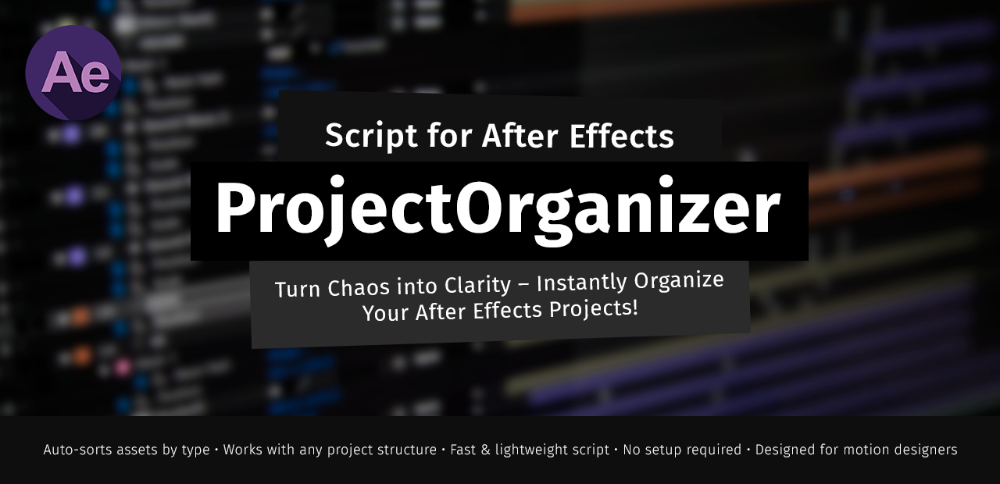

# 🎬 Project Organizer for After Effects
[](https://www.buymeacoffee.com/jakkimcfly)


**Project Organizer** is a simple but powerful script for Adobe After Effects that automatically sorts project items into folders based on their type (Videos, Images, Audio, Compositions, Solids, and more).  
It helps you keep your project tidy and structured with a single click.


## ⚡ Features

- Automatically create folders for:
  - Videos (`.mp4`, `.mov`, `.avi`, etc.)
  - Images (`.jpg`, `.png`, `.gif`, etc.)
  - Audio (`.mp3`, `.wav`, etc.)
  - Compositions
  - Solids
  - Other files
- Exclude files by name or comment
- Custom folder names and file extension filters
- Save and restore user settings
- Simple UI built into After Effects

## 📦 Installation

1. Download the script file: `ProjectOrganizer.jsx`
2. Move it into your After Effects `Scripts` folder:
   - **Windows:** `C:\Program Files\Adobe\Adobe After Effects\Support Files\Scripts\`
   - **macOS:** `/Applications/Adobe After Effects/Scripts/`
3. Launch After Effects
4. Go to `File > Scripts > ProjectOrganizer`

> 💡 You can enable "Allow Scripts to Write Files and Access Network" in `Edit > Preferences > Scripting & Expressions`.

## 🚀 Usage

1. Open your After Effects project.
2. Run the script via `File > Scripts > ProjectOrganizer`.
3. Select which folders you want to generate.
4. Optionally, define custom extensions and exclusion rules.
5. Click **Submit** – your project is now clean and organized!

## 📂 Example

**Before:**
```
Project
├── footage1.mp4
├── song.wav
├── comp1
└── image.png
```

**After:**
```
Project
├── Videos
│   └── footage1.mp4
├── Audio
│   └── song.wav
├── Images
│   └── image.png
└── Comp
    └── comp1
```


## 🛠️ Development
This script is written in ExtendScript (JavaScript for Adobe apps).  
Feel free to contribute or fork this repository!

## 📃 License
This project is licensed under the [MIT License](LICENSE).

## 💬 Questions?
Have a suggestion, issue or feature request? Feel free to [open an issue](https://github.com/jakkimcfly/project-organizer/issues/new/choose) or pull request!

## ✨ Support

If you find this script helpful, consider ⭐ starring the repo or buying me a coffee:

<a href="https://www.buymeacoffee.com/jakkimcfly" target="_blank">
    
</a>